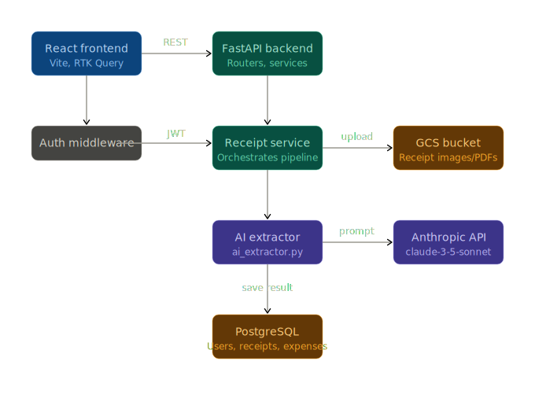

```
Now here's the reasoning behind every major decision:

- Why feature-based, not layer-based? A layer-based structure (models/, routes/, services/) means when you work on receipts, you're jumping between 4 folders. Feature-based means everything about receipts — model, schema, route, service, AI extractor — lives in features/receipts/. One folder, full context. This is how every serious production codebase is structured.

- Why ai_extractor.py inside the receipts feature? Because it's a receipt concern. If tomorrow we swap Anthropic for OpenAI, we change one file and nothing else breaks. service.py doesn't care how extraction works — it just calls extract_receipt_data(file_bytes) and gets structured JSON back. That's the boundary.

- Why shared/ on both sides? The rule is strict — features never import from each other. If expenses needs something from receipts, that thing belongs in shared/. This prevents the spaghetti that makes most codebases unmaintainable after 6 months.

- Why RTK Query on the frontend? It handles caching, loading/error states, and token refresh automatically. You'd spend a week building that from scratch with plain fetch. It pairs with Redux so your auth state (token, user) lives globally and any component can access it.

- Why docker-compose.yml at the root? One command — docker compose up — starts Postgres, the backend, and the frontend together. No "works on my machine" problems. This is also exactly what the CI/CD pipeline will use.


The receipt upload flow end to end:

1. User drops a file in UploadDropzone.jsx
2. receiptsApi.js sends a multipart/form-data POST to /receipts/upload
3. router.py validates the JWT, calls service.py
4. service.py uploads the raw file to GCS, then calls ai_extractor.py
5. ai_extractor.py sends the file + a structured extraction prompt to Anthropic API, gets back JSON (merchant, amount, date, category, line items)
6. service.py saves the receipt + creates an Expense record in Postgres
7. Response goes back to the frontend — the card re-renders with the extracted data


```